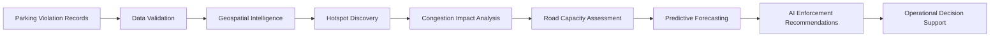
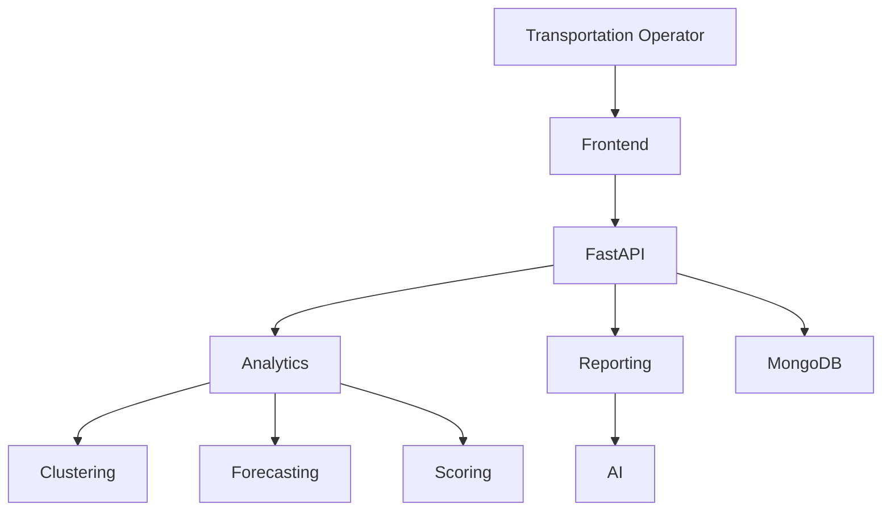

# ParkPulse AI

*Transforming Parking Violations into Urban Mobility Intelligence*

[https://smart-parking-hub-44.preview.emergentagent.com/]

Link for the demo/prototype : [https://drive.google.com/file/d/1qlwNazX3r9ODzuosE54_278socqm9afv/view?usp=drive_link]

# Executive Summary

Urban congestion is commonly associated with increasing vehicle volumes, inadequate infrastructure, and inefficient traffic management. However, one of the most overlooked contributors to localized traffic disruption is illegal and spillover parking.

Vehicles parked along carriageways, intersections, transit stations, commercial districts, and event zones significantly reduce effective roadway capacity, creating bottlenecks that propagate through the transportation network.

Despite its impact, parking enforcement remains largely reactive. Municipal agencies typically rely on manual patrols and citizen complaints, resulting in delayed interventions and inefficient deployment of enforcement resources.

ParkPulse AI addresses this challenge through an AI-driven parking intelligence platform that transforms parking violation records into actionable traffic intelligence. By combining geospatial analytics, hotspot detection, congestion impact modeling, predictive forecasting, and AI-generated operational reporting, the platform enables transportation authorities to proactively identify high-risk zones and optimize enforcement strategies.

# Imagine This Scenario

It is 8:45 AM on a weekday morning.

Thousands of commuters are heading toward commercial districts, metro stations, office complexes, and transit hubs.

Traffic begins slowing near a major intersection.

Vehicles are not moving.

Public buses are delayed.

Ride-sharing pickups are piling up.

Emergency vehicles struggle to navigate through the corridor.

Traffic operators observe congestion building rapidly.

Yet the root cause is not an accident.

It is not road construction.

It is not unusually high traffic demand.

Instead, a series of illegally parked vehicles have reduced the effective roadway width, creating a bottleneck that propagates through the network.

This scenario occurs every day across cities worldwide.

Yet transportation agencies rarely possess the intelligence needed to identify these locations before congestion becomes a problem.

# Hidden Cost of Parking Violations

Illegal parking is often treated as an enforcement problem.

In reality, it is a mobility problem.

A single improperly parked vehicle can:

- Block a travel lane
- Reduce intersection throughput
- Obstruct turning movements
- Delay public transport
- Increase travel times
- Create secondary congestion corridors

When multiplied across hundreds or thousands of violations, the impact becomes substantial.

Despite this, most cities cannot answer fundamental questions such as:

- Which parking hotspots create the most congestion?
- Which violations should enforcement teams prioritize?
- Which corridors are most vulnerable during peak hours?
- How much roadway capacity is being lost?
- Where should enforcement resources be deployed tomorrow?

# Intelligence Gap

Modern cities collect enormous volumes of parking and enforcement data.

However, most systems stop at reporting violations.

Typical workflows answer:

> Where did violations occur?

But transportation operators actually need to know:

> Which violations are creating the greatest disruption to traffic flow?

This intelligence gap results in:

- Reactive enforcement
- Delayed interventions
- Poor resource allocation
- Limited operational visibility
- Inefficient congestion management

# Challenge Statement

# Problem Statement

Poor Visibility on Parking-Induced Congestion

# Operational Challenge

On-street illegal parking and spillover parking near:

- Commercial districts
- Metro stations
- Transit hubs
- Event venues
- High-density urban corridors

reduce roadway capacity and obstruct traffic flow.

These parking violations frequently:

- Block travel lanes
- Narrow carriageways
- Obstruct intersections
- Reduce turning efficiency
- Increase queue lengths
- Cause localized congestion

## Why It Is Difficult Today

Current parking enforcement systems are primarily:

- Patrol-based
- Manual
- Reactive
- Resource intensive

As a result:

- Enforcement teams lack visibility into emerging congestion hotspots.
- Parking violations are not correlated with traffic impact.
- There is no city-wide intelligence layer for prioritization.
- Resources are often deployed inefficiently.

## Challenge

> How can AI-driven parking intelligence detect illegal parking hotspots and quantify their impact on traffic flow to enable targeted enforcement?

# Introducing ParkPulse AI

ParkPulse AI is an urban mobility intelligence platform that transforms parking violation records into actionable operational insights.

The platform combines:

- Geospatial Intelligence
- Spatial Clustering
- Congestion Analytics
- Predictive Forecasting
- AI-Powered Reporting
- Interactive Visualization

to help transportation agencies move from reactive enforcement toward proactive congestion prevention.

# Our Hypothesis

We began with a simple assumption:

> Not all parking violations are equally harmful.

Some violations occur in low-impact areas.

Others create severe congestion because they occur near:

- Major intersections
- Transit stations
- Commercial corridors
- Event venues
- High-volume arterials

If we could identify these locations automatically and quantify their traffic impact, enforcement teams could focus their efforts where they matter most.

# From Raw Data to Operational Intelligence

ParkPulse AI converts raw parking records into a decision-support system.

# Understanding the City Through Data

Every parking violation contains valuable spatial information.

A single record tells us:

- Where the event occurred
- When it occurred
- How frequently similar violations occur
- Whether it contributes to recurring congestion

When aggregated across an entire city, these records reveal hidden behavioral patterns.

Our goal was to uncover those patterns automatically.

# Discovering Hidden Hotspots

Human analysts can inspect maps manually.

Cities cannot.

Instead, ParkPulse AI uses advanced geospatial clustering techniques to discover areas where violations naturally concentrate.

The system continuously identifies:

- Emerging hotspots
- Persistent hotspots
- High-density corridors
- Critical enforcement zones

Technologies employed:

- DBSCAN
- HDBSCAN
- MiniBatch K-Means

These clusters become the foundation for subsequent congestion analysis and predictive intelligence.

# Beyond Violations: Measuring Impact

A hotspot is not necessarily a problem.

The real question is:

> How much congestion does it create?

To answer this, ParkPulse AI evaluates:

*Density*

How concentrated are violations?

*Temporal Activity*

Do violations occur during peak traffic periods?

*Network Criticality*

Does the hotspot occur near a critical intersection?

*Recurrence*

Does the behavior repeat consistently?

These factors are combined into a congestion impact model that prioritizes hotspots according to operational severity.

# Quantifying Roadway Degradation

Illegal parking reduces the effective width of the roadway.

This reduction translates directly into:

- Reduced throughput
- Increased delay
- Longer queues
- Reduced mobility
- Higher congestion risk

ParkPulse AI estimates the extent of roadway degradation caused by parking activity and visualizes its effect across the transportation network.

This allows agencies to move beyond simple violation counts and quantify actual operational impact.

# Looking Into the Future

Transportation operators do not only need to understand what happened.

They need to understand what will happen.

ParkPulse AI analyzes historical trends to forecast:

- Future congestion hotspots
- Escalating risk zones
- Enforcement demand
- Capacity degradation
- Traffic disruption likelihood

Forecasts are generated across:

- Hourly horizons
- Daily horizons
- Weekly horizons

This enables proactive intervention before congestion becomes visible on the road network.

# Turning Analytics into Action

Data alone does not improve operations.

Decisions do.

To bridge this gap, ParkPulse AI automatically generates intelligence briefings containing:

- Executive summaries
- Priority hotspots
- Enforcement recommendations
- Forecast insights
- Operational risk assessments

This allows decision-makers to move from dashboards to action quickly and confidently.

# What Was Built

The final platform consists of six integrated intelligence modules.

*Executive Command Center*

Provides a city-wide operational overview of parking-induced congestion.

*Hotspot Intelligence Engine*

Interactive geospatial hotspot visualization and analysis.

*Congestion Analytics*

Quantification of traffic impact and roadway degradation.

*Predictive Intelligence*

Forecasting of future hotspot activity and risk.

*Enforcement Intelligence*

Prioritization and recommendation system.

*Scenario Simulator*

Exploration of intervention strategies and congestion outcomes.

# Application Walkthrough

The following screenshots demonstrate how ParkPulse AI transforms raw parking violation records into actionable urban mobility intelligence.

# Understanding the Problem

*Parking-Induced Congestion Challenge**

This view introduces the operational challenge faced by transportation authorities and highlights how illegal parking contributes to congestion, reduced roadway capacity, and inefficient enforcement.

# Solution Overview

**ParkPulse AI Approach**

This screen presents the overall solution architecture and explains how geospatial intelligence, congestion analytics, forecasting, and AI-generated recommendations work together.

# Executive Command Center

*City Operations Control Room*

Provides transportation operators with a city-wide operational overview of parking-induced congestion.

# Key Capabilities

- Network-wide situational awareness
- Congestion monitoring
- Hotspot prioritization
- Executive KPI tracking

## Executive Dashboard

Consolidated visualization of violations, congestion severity, hotspot activity, and operational performance.

# Hotspot Intelligence

*Geospatial Hotspot Detection*

Visualizes parking violation concentrations using spatial clustering and geospatial analytics.

### Features

- Heatmap visualization
- Cluster identification
- Severity classification
- Geographic prioritization

# Predictive Intelligence

*Forecast Dashboard*

Provides forward-looking congestion intelligence based on historical parking behavior.

## Short-Term Congestion Forecasting

*Forecasts emerging hotspots and anticipated congestion escalation*

*Trend Analysis & Risk Assessment*

Supports proactive traffic management through predictive analytics.

*Long-Term Forecasting*

Projects hotspot evolution and enforcement demand over extended periods.

# Enforcement Intelligence

*Enforcement Operations Dashboard*

Identifies high-priority zones requiring intervention and resource deployment.

*AI Enforcement Briefing*

Automatically generated operational intelligence report containing hotspot summaries, risk assessments, and recommended actions.

# Advanced Analytics

*Analytics Dashboard*

Provides deeper insight into parking behavior and congestion dynamics.

*Congestion Intelligence Analytics*

Enables investigation of disruption patterns and operational risk.

*Spatial Performance Analytics*

Evaluates hotspot evolution and enforcement effectiveness.

# Scenario Simulation

*Intervention Simulator*

Allows transportation agencies to evaluate the impact of mitigation strategies before deployment.

*Simulation Objectives*

- Capacity-loss estimation
- Resource planning
- Risk evaluation
- Enforcement optimization

# Data Ingestion & Processing

*Dataset Upload Pipeline*

Supports ingestion, validation, and processing of parking violation datasets.

# End-to-End Operational Workflow

The resulting intelligence enables transportation authorities to transition from reactive parking enforcement toward proactive congestion management.

# Technology Stack

| Layer | Technology |
|---------|------------|
| Frontend | React |
| Backend | FastAPI |
| Database | MongoDB |
| Geospatial Analytics | DBSCAN, HDBSCAN, MiniBatch K-Means |
| Forecasting | Machine Learning Models |
| Mapping | Leaflet |
| AI Reporting | LLM Integration |

# Solution Architecture

# Business Impact

By transforming parking violations into actionable congestion intelligence, ParkPulse AI enables:

- Reduced traffic congestion
- Faster hotspot identification
- Improved roadway utilization
- Optimized enforcement deployment
- Data-driven transportation planning
- Enhanced operational visibility
- Improved commuter experience
- Smarter allocation of municipal resources
- Better urban mobility outcomes

Ultimately, ParkPulse AI transforms parking enforcement from a reactive operational activity into an intelligence-driven mobility management system.

# Link for the demo prototype 

Link : [https://smart-parking-hub-44.preview.emergentagent.com/]

# Contributors

Rithanya Raj & Anjan Mahapatra
