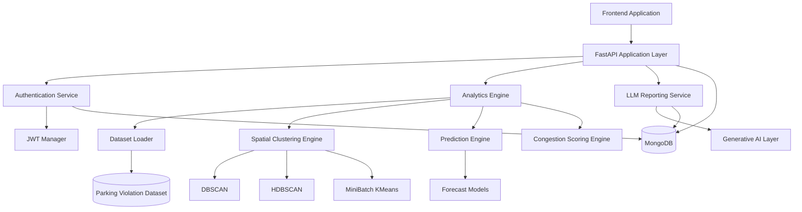
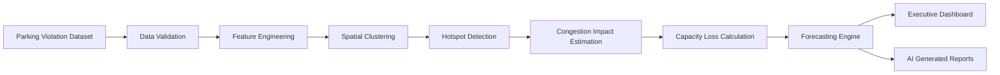
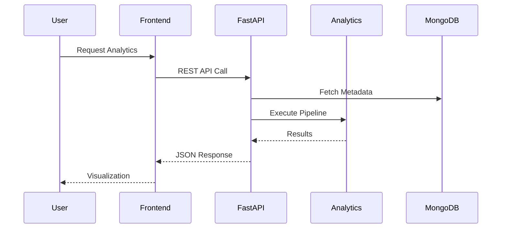

# ParkPulse AI Backend


---

## Overview

ParkPulse AI Backend is a production-grade geospatial intelligence and urban mobility analytics platform designed to identify, quantify, and predict parking-induced traffic congestion using advanced machine learning, spatial analytics, and artificial intelligence.

The backend serves as the computational core of the ParkPulse AI ecosystem, transforming parking violation datasets into actionable operational intelligence for municipalities, transportation authorities, traffic management centers, and smart city command-and-control systems.

The platform integrates spatial clustering algorithms, congestion impact estimation, predictive analytics, and AI-generated operational reporting to support evidence-based decision making in urban mobility management.

---

## Core Capabilities

### Parking Hotspot Intelligence

Detects and prioritizes parking-induced congestion zones using density-based geospatial clustering techniques.

**Outputs include:**

- Violation hotspot detection
- Cluster boundary generation
- Congestion severity estimation
- Spatial density analysis
- High-risk corridor identification
- Enforcement prioritization

---

### Congestion Impact Analytics

Quantifies the operational impact of illegal parking on road network performance.

**Metrics include:**

- Congestion Impact Score (CIS)
- Road Capacity Loss
- Violation Density Index
- Peak Hour Disruption Index
- Severity Classification

---

### Predictive Analytics

Forecasts future parking-induced congestion using historical mobility patterns.

**Prediction Horizons**

- Hourly Forecasting
- Daily Forecasting
- Weekly Forecasting

---

### Executive Intelligence

Provides city-scale operational KPIs including:

- Total Violations
- Active Hotspots
- Critical Zones
- Congestion Distribution
- Capacity Reduction Trends
- Enforcement Performance Metrics

---

### AI-Generated Reporting

Automatically generates:

- Executive Summaries
- Situation Reports
- Enforcement Recommendations
- Traffic Intelligence Briefs
- Operational Narratives

---

### Security & Access Control

Enterprise-grade authentication and authorization framework supporting:

- JWT Authentication
- Role-Based Access Control (RBAC)
- Refresh Tokens
- Password Hashing
- Session Validation
- Protected Administrative Operations

---

# System Architecture



---

# Analytics Pipeline



---

# Backend Architecture

## API Layer

The FastAPI application exposes RESTful services for:

- Hotspot Analytics
- Congestion Intelligence
- Predictive Modeling
- Dashboard Aggregation
- Administrative Operations
- AI Report Generation

---

## Data Layer

Responsible for:

- Dataset ingestion
- Data validation
- Metadata persistence
- Analytics caching
- User management
- Session storage

MongoDB serves as the primary persistence layer.

---

## Analytics Layer

Implements the geospatial intelligence pipeline.

### Supported Algorithms

| Module | Algorithm |
|----------|------------|
| Density Clustering | DBSCAN |
| Hierarchical Clustering | HDBSCAN |
| Spatial Segmentation | MiniBatch K-Means |
| Forecasting | Gradient Boosting Models |
| Severity Scoring | Hybrid Rule Engine |

---

## Reporting Layer

Generates natural-language intelligence summaries for:

- Municipal administrators
- Traffic police
- Smart city operators
- Executive leadership

---

## Machine Learning Framework

The analytics engine employs a hybrid geospatial intelligence framework that combines density-based clustering, congestion impact modeling, and predictive analytics to identify and prioritize parking-induced traffic disruptions.

---

### Spatial Hotspot Detection

Parking hotspots are identified using spatial clustering algorithms operating on geographic coordinates extracted from parking violation records.

Given a dataset of parking violations:

```text
X = {x₁, x₂, ..., xₙ}
```

where:

```text
xᵢ = (latitudeᵢ, longitudeᵢ)
```

Each observation represents the spatial location of a parking violation event.

---

### DBSCAN Formulation

Density-Based Spatial Clustering of Applications with Noise (DBSCAN) identifies clusters as dense regions separated by sparse regions.

Neighborhood definition:

```text
Nε(p) = { q ∈ X | d(p,q) ≤ ε }
```

where:

- ε = neighborhood radius
- MinPts = minimum density threshold

A point is considered a core point when:

```text
|Nε(p)| ≥ MinPts
```

Clusters are formed by recursively connecting density-reachable observations.

---

### HDBSCAN Formulation

Hierarchical Density-Based Spatial Clustering extends DBSCAN by supporting varying density distributions.

Mutual reachability distance:

```text
dmreach(a,b) =
max{
    core(a),
    core(b),
    d(a,b)
}
```

where:

- core(a) = core distance of point a
- core(b) = core distance of point b
- d(a,b) = Euclidean distance

This formulation improves robustness when hotspot densities vary significantly across urban regions.

---

### MiniBatch K-Means Formulation

MiniBatch K-Means partitions observations into K spatial clusters.

Cluster centroid estimation:

```text
μk = (1 / |Ck|) × Σ xi
```

for all:

```text
xi ∈ Ck
```

Optimization objective:

```text
J = Σk Σxi∈Ck ||xi − μk||²
```

where:

- μk = centroid of cluster k
- Ck = cluster k
- J = within-cluster sum of squared errors

The objective is to minimize intra-cluster variance.

---

### Congestion Impact Score (CIS)

Each hotspot is assigned a normalized congestion severity score.

```text
CIS =
(w₁ × D)
+
(w₂ × P)
+
(w₃ × J)
+
(w₄ × R)
```

where:

| Variable | Description |
|----------|-------------|
| D | Violation Density |
| P | Peak Hour Frequency |
| J | Junction Criticality |
| R | Repeat Offender Index |

Subject to:

```text
w₁ + w₂ + w₃ + w₄ = 1
```

Default weighting:

```text
[w₁, w₂, w₃, w₄]
=
[0.40, 0.30, 0.20, 0.10]
```

Higher CIS values indicate greater disruption to traffic flow.

---

### Road Capacity Loss Estimation

Road capacity degradation is estimated as:

```text
Capacity Loss (%) =
(Blocked Width / Available Width) × 100
```

where:

- Blocked Width = roadway width occupied by illegally parked vehicles
- Available Width = usable roadway width

This metric quantifies the reduction in effective traffic carrying capacity.

---

### Forecasting Framework

Future congestion intensity is estimated using temporal and spatial features.

Prediction model:

```text
ŷ(t+k) = f(Xt)
```

where:

```text
Xt =
{
    hour,
    day_of_week,
    week_of_year,
    violation_density,
    hotspot_severity
}
```

and:

```text
k = forecasting horizon
```

Typical forecasting horizons include:

```text
1 Hour Ahead
24 Hours Ahead
7 Days Ahead
```

The forecasting engine estimates future hotspot severity and congestion impact.

---

### Severity Classification

Hotspots are categorized according to congestion impact score.

```text
0.00 ≤ CIS < 0.30  → Low

0.30 ≤ CIS < 0.60  → Moderate

0.60 ≤ CIS < 0.80  → High

0.80 ≤ CIS ≤ 1.00  → Critical
```

Severity classes support:

- Enforcement prioritization
- Resource allocation
- Incident response planning
- Executive reporting

---

### Model Outputs

The analytics engine produces:

- Spatial Hotspot Clusters
- Congestion Impact Scores
- Capacity Loss Estimates
- Severity Classifications
- Future Congestion Forecasts
- Enforcement Recommendations
- AI-Generated Operational Reports

These outputs collectively enable data-driven urban mobility management and parking enforcement operations.

---

# API Request Lifecycle



---

# Security Architecture


### Security Controls

- JWT-based authentication
- Role-Based Access Control (RBAC)
- bcrypt password hashing
- Secure token lifecycle management
- Protected administrative endpoints
- Request validation using Pydantic schemas
- Authentication middleware enforcement

---

# Repository Structure

```text
backend/
│
├── server.py
├── routes.py
├── auth.py
├── db.py
├── data_store.py
├── pipeline.py
├── llm_service.py
├── requirements.txt

```

---

# Performance Characteristics

| Metric | Capability |
|----------|-----------|
| Dataset Scale | 50,000+ Records |
| Clustering Engine | Parallel Processing |
| API Architecture | Asynchronous |
| Response Format | JSON |
| Database | MongoDB |
| Deployment | Container Ready |
| Analytics Engine | Real-Time Computation |

---

# License

This project is licensed under the MIT License.

---

# Contributor

Rithanya Raj & Anjan Mahapatra
