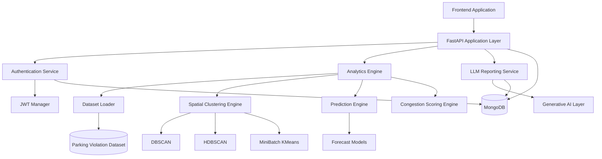
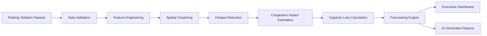
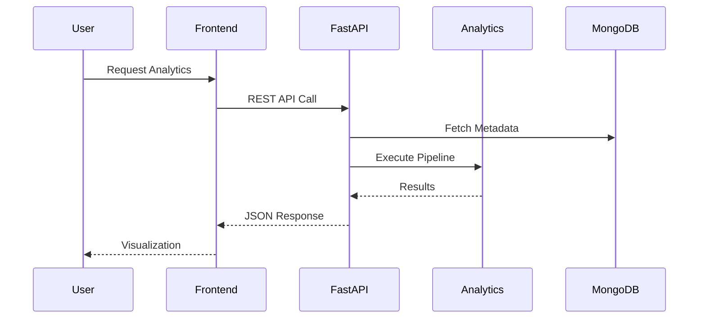

# ParkPulse AI Backend


---

## Overview

ParkPulse AI Backend is a production-grade geospatial intelligence and urban mobility analytics platform designed to identify, quantify, and predict parking-induced traffic congestion using advanced machine learning, spatial analytics, and artificial intelligence.

The backend serves as the computational core of the ParkPulse AI ecosystem, transforming parking violation datasets into actionable operational intelligence for municipalities, transportation authorities, traffic management centers, and smart city command-and-control systems.

The platform integrates spatial clustering algorithms, congestion impact estimation, predictive analytics, and AI-generated operational reporting to support evidence-based decision making in urban mobility management.

---

## Core Capabilities

### Parking Hotspot Intelligence

Detects and prioritizes parking-induced congestion zones using density-based geospatial clustering techniques.

**Outputs include:**

- Violation hotspot detection
- Cluster boundary generation
- Congestion severity estimation
- Spatial density analysis
- High-risk corridor identification
- Enforcement prioritization

---

### Congestion Impact Analytics

Quantifies the operational impact of illegal parking on road network performance.

**Metrics include:**

- Congestion Impact Score (CIS)
- Road Capacity Loss
- Violation Density Index
- Peak Hour Disruption Index
- Severity Classification

---

### Predictive Analytics

Forecasts future parking-induced congestion using historical mobility patterns.

**Prediction Horizons**

- Hourly Forecasting
- Daily Forecasting
- Weekly Forecasting

---

### Executive Intelligence

Provides city-scale operational KPIs including:

- Total Violations
- Active Hotspots
- Critical Zones
- Congestion Distribution
- Capacity Reduction Trends
- Enforcement Performance Metrics

---

### AI-Generated Reporting

Automatically generates:

- Executive Summaries
- Situation Reports
- Enforcement Recommendations
- Traffic Intelligence Briefs
- Operational Narratives

---

### Security & Access Control

Enterprise-grade authentication and authorization framework supporting:

- JWT Authentication
- Role-Based Access Control (RBAC)
- Refresh Tokens
- Password Hashing
- Session Validation
- Protected Administrative Operations

---

# System Architecture



---

# Analytics Pipeline



---

# Backend Architecture

## API Layer

The FastAPI application exposes RESTful services for:

- Hotspot Analytics
- Congestion Intelligence
- Predictive Modeling
- Dashboard Aggregation
- Administrative Operations
- AI Report Generation

---

## Data Layer

Responsible for:

- Dataset ingestion
- Data validation
- Metadata persistence
- Analytics caching
- User management
- Session storage

MongoDB serves as the primary persistence layer.

---

## Analytics Layer

Implements the geospatial intelligence pipeline.

### Supported Algorithms

| Module | Algorithm |
|----------|------------|
| Density Clustering | DBSCAN |
| Hierarchical Clustering | HDBSCAN |
| Spatial Segmentation | MiniBatch K-Means |
| Forecasting | Gradient Boosting Models |
| Severity Scoring | Hybrid Rule Engine |

---

## Reporting Layer

Generates natural-language intelligence summaries for:

- Municipal administrators
- Traffic police
- Smart city operators
- Executive leadership

---

## Machine Learning Framework

The analytics engine employs a hybrid geospatial intelligence framework that combines density-based clustering, congestion impact modeling, and predictive analytics to identify and prioritize parking-induced traffic disruptions.

---

### Spatial Hotspot Detection

Parking hotspots are identified using spatial clustering algorithms operating on geographic coordinates extracted from parking violation records.

Given a dataset of parking violations:

Given a dataset of parking violations:

```math
X = \{x_1, x_2, \ldots, x_n\}
```

where:

```math
x_i = (\text{latitude}_i,\ \text{longitude}_i)
```

Each observation represents the spatial location of a parking violation event.

---

### DBSCAN Formulation

Density-Based Spatial Clustering of Applications with Noise (DBSCAN) identifies clusters as dense regions separated by sparse regions.

Neighborhood definition:

```math
N_{\varepsilon}(p)
=
\left\{
q \in X \; | \; d(p,q) \leq \varepsilon
\right\}
```

where:

- \( \varepsilon \) = neighborhood radius
- MinPts = minimum density threshold

A point is considered a core point when:

```math
\left|N_{\varepsilon}(p)\right|
\geq
\text{MinPts}
```

Clusters are formed by recursively connecting density-reachable observations.

---

### HDBSCAN Formulation

Mutual reachability distance:

```math
d_{\mathrm{mreach}}(a,b)
=
\max \left\{
\mathrm{core}(a),
\mathrm{core}(b),
d(a,b)
\right\}
```

where:

- \( \mathrm{core}(a) \) = core distance of point \( a \)
- \( \mathrm{core}(b) \) = core distance of point \( b \)
- \( d(a,b) \) = Euclidean distance between points \( a \) and \( b \)

This formulation enables robust clustering across regions exhibiting heterogeneous density distributions.

---

### MiniBatch K-Means Formulation

MiniBatch K-Means partitions observations into \(K\) spatial clusters by minimizing the within-cluster variance.

Cluster centroid estimation:

```math
\mu_k
=
\frac{1}{|C_k|}
\sum_{x_i \in C_k} x_i
```

where:

- \( \mu_k \) = centroid of cluster \(k\)
- \( C_k \) = set of observations assigned to cluster \(k\)

The optimization objective is:

```math
J
=
\sum_{k=1}^{K}
\sum_{x_i \in C_k}
\left\|x_i-\mu_k\right\|^2
```

where:

- \( J \) = within-cluster sum of squared errors (WCSS)
- \( \|x_i-\mu_k\|^2 \) = squared Euclidean distance between observation \(x_i\) and centroid \(\mu_k\)

The objective of the algorithm is to minimize:

```math
\underset{\{\mu_k\}_{k=1}^{K}}{\arg\min}
\sum_{k=1}^{K}
\sum_{x_i \in C_k}
\left\|x_i-\mu_k\right\|^2
```

resulting in compact and spatially coherent parking hotspot clusters.

---

### Congestion Impact Score (CIS)

Each hotspot is assigned a normalized congestion severity score that quantifies the operational impact of parking violations on traffic flow.

The Congestion Impact Score is computed as:

```math
\mathrm{CIS}
=
w_1D
+
w_2P
+
w_3J
+
w_4R
```

where:

| Variable | Description |
|-----------|-------------|
| \(D\) | Violation Density |
| \(P\) | Peak Hour Frequency |
| \(J\) | Junction Criticality |
| \(R\) | Repeat Offender Index |

and

| Weight | Contribution |
|---------|-------------|
| \(w_1\) | Density Weight |
| \(w_2\) | Peak Hour Weight |
| \(w_3\) | Junction Criticality Weight |
| \(w_4\) | Repeat Violation Weight |

Subject to the normalization constraint:

```math
\sum_{i=1}^{4} w_i = 1
```

The default weighting scheme is:

```math
[w_1,w_2,w_3,w_4]
=
[0.40,\;0.30,\;0.20,\;0.10]
```

such that:

- 40% emphasis is placed on violation density.
- 30% emphasis is placed on peak-hour disruption.
- 20% emphasis is placed on junction criticality.
- 10% emphasis is placed on repeat offender behavior.

A larger CIS value indicates a greater disruption to roadway operations and a higher enforcement priority.

### Road Capacity Loss Estimation

Road capacity degradation is quantified using the percentage reduction in the effective roadway width caused by illegally parked vehicles.

The Capacity Loss metric is defined as:

```math
\mathrm{Capacity\ Loss}
=
\frac{W_b}{W_a}
\times 100
```

where:

| Symbol | Description |
|----------|-------------|
| \(W_b\) | Blocked roadway width due to parking encroachment |
| \(W_a\) | Total available roadway width |

The resulting value represents the percentage of roadway capacity rendered unavailable to moving traffic.

For example, if a roadway with an effective width of 10 meters experiences 2 meters of parking encroachment:

```math
\mathrm{Capacity\ Loss}
=
\frac{2}{10}
\times 100
=
20\%
```

Higher Capacity Loss values indicate increased traffic friction, reduced lane availability, and a greater likelihood of localized congestion.

---

### Forecasting Framework

Future congestion intensity is estimated using historical temporal and spatial characteristics of parking violations.

The forecasting model is represented as:

```math
\hat{y}_{t+k}
=
f(X_t)
```

where:

| Symbol | Description |
|----------|-------------|
| \(\hat{y}_{t+k}\) | Predicted congestion intensity at future time \(t+k\) |
| \(X_t\) | Feature vector observed at time \(t\) |
| \(f(\cdot)\) | Forecasting model |
| \(k\) | Forecast horizon |

The input feature vector is defined as:

```math
X_t =
\left\{
\text{hour},
\text{day\_of\_week},
\text{week\_of\_year},
\text{violation\_density},
\text{hotspot\_severity}
\right\}
```

The forecasting objective is:

```math
f:
X_t
\rightarrow
\hat{y}_{t+k}
```

Typical forecasting horizons include:

| Horizon | Description |
|----------|-------------|
| \(k = 1\) | One Hour Ahead |
| \(k = 24\) | Twenty-Four Hours Ahead |
| \(k = 168\) | Seven Days Ahead |

The forecasting engine estimates future hotspot severity, expected congestion levels, and potential traffic disruption, enabling proactive enforcement and operational planning.

---

### Severity Classification

Hotspots are categorized according to their Congestion Impact Score (CIS) to support operational decision-making and enforcement prioritization.

The severity level is defined as:

```math
\mathrm{Severity} =
\begin{cases}
\mathrm{Low}, & 0.00 \leq \mathrm{CIS} < 0.30 \\
\mathrm{Moderate}, & 0.30 \leq \mathrm{CIS} < 0.60 \\
\mathrm{High}, & 0.60 \leq \mathrm{CIS} < 0.80 \\
\mathrm{Critical}, & 0.80 \leq \mathrm{CIS} \leq 1.00
\end{cases}
```

The corresponding operational interpretation is:

| CIS Range | Severity Level | Operational Impact |
|------------|---------------|-------------------|
| 0.00 – 0.29 | Low | Minimal disruption to traffic flow |
| 0.30 – 0.59 | Moderate | Localized congestion effects |
| 0.60 – 0.79 | High | Significant reduction in roadway efficiency |
| 0.80 – 1.00 | Critical | Severe congestion requiring immediate intervention |

Severity classes support:

- Enforcement prioritization
- Resource allocation
- Incident response planning
- Traffic operations management
- Executive reporting and policy evaluation

Higher severity levels indicate greater congestion impact and increased urgency for enforcement action.

---

### Model Outputs

The analytics engine produces:

- Spatial Hotspot Clusters
- Congestion Impact Scores
- Capacity Loss Estimates
- Severity Classifications
- Future Congestion Forecasts
- Enforcement Recommendations
- AI-Generated Operational Reports

These outputs collectively enable data-driven urban mobility management and parking enforcement operations.

---

# API Request Lifecycle



---

# Security Architecture


### Security Controls

- JWT-based authentication
- Role-Based Access Control (RBAC)
- bcrypt password hashing
- Secure token lifecycle management
- Protected administrative endpoints
- Request validation using Pydantic schemas
- Authentication middleware enforcement

---

# Repository Structure

```text
backend/
│
├── server.py
├── routes.py
├── auth.py
├── db.py
├── data_store.py
├── pipeline.py
├── llm_service.py
├── requirements.txt

```

---

# Performance Characteristics

| Metric | Capability |
|----------|-----------|
| Dataset Scale | 50,000+ Records |
| Clustering Engine | Parallel Processing |
| API Architecture | Asynchronous |
| Response Format | JSON |
| Database | MongoDB |
| Deployment | Container Ready |
| Analytics Engine | Real-Time Computation |

---

# License

This project is licensed under the MIT License.

---

# Contributor

Rithanya Raj & Anjan Mahapatra
