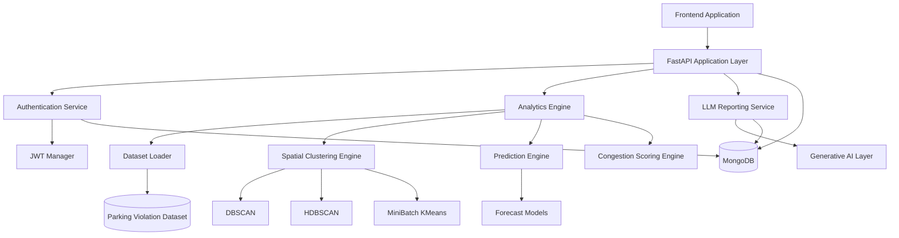
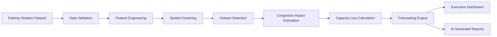
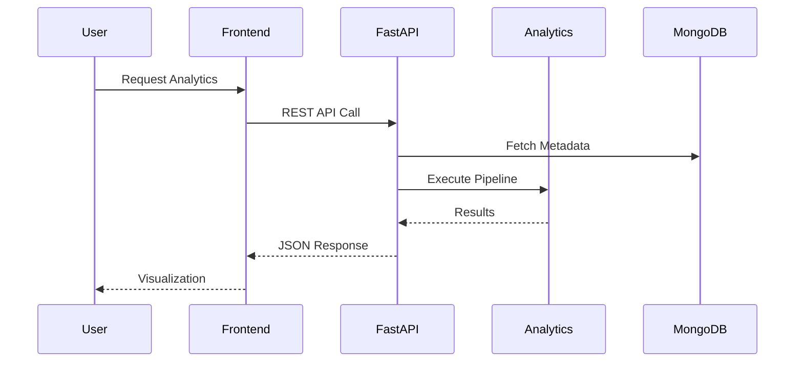

# ParkPulse AI Backend


---

## Overview

ParkPulse AI Backend is a production-grade geospatial intelligence and urban mobility analytics platform designed to identify, quantify, and predict parking-induced traffic congestion using advanced machine learning, spatial analytics, and artificial intelligence.

The backend serves as the computational core of the ParkPulse AI ecosystem, transforming parking violation datasets into actionable operational intelligence for municipalities, transportation authorities, traffic management centers, and smart city command-and-control systems.

The platform integrates spatial clustering algorithms, congestion impact estimation, predictive analytics, and AI-generated operational reporting to support evidence-based decision making in urban mobility management.

---

## Core Capabilities

### Parking Hotspot Intelligence

Detects and prioritizes parking-induced congestion zones using density-based geospatial clustering techniques.

**Outputs include:**

- Violation hotspot detection
- Cluster boundary generation
- Congestion severity estimation
- Spatial density analysis
- High-risk corridor identification
- Enforcement prioritization

---

### Congestion Impact Analytics

Quantifies the operational impact of illegal parking on road network performance.

**Metrics include:**

- Congestion Impact Score (CIS)
- Road Capacity Loss
- Violation Density Index
- Peak Hour Disruption Index
- Severity Classification

---

### Predictive Analytics

Forecasts future parking-induced congestion using historical mobility patterns.

**Prediction Horizons**

- Hourly Forecasting
- Daily Forecasting
- Weekly Forecasting

---

### Executive Intelligence

Provides city-scale operational KPIs including:

- Total Violations
- Active Hotspots
- Critical Zones
- Congestion Distribution
- Capacity Reduction Trends
- Enforcement Performance Metrics

---

### AI-Generated Reporting

Automatically generates:

- Executive Summaries
- Situation Reports
- Enforcement Recommendations
- Traffic Intelligence Briefs
- Operational Narratives

---

### Security & Access Control

Enterprise-grade authentication and authorization framework supporting:

- JWT Authentication
- Role-Based Access Control (RBAC)
- Refresh Tokens
- Password Hashing
- Session Validation
- Protected Administrative Operations

---

# System Architecture



---

# Analytics Pipeline



---

# Backend Architecture

## API Layer

The FastAPI application exposes RESTful services for:

- Hotspot Analytics
- Congestion Intelligence
- Predictive Modeling
- Dashboard Aggregation
- Administrative Operations
- AI Report Generation

---

## Data Layer

Responsible for:

- Dataset ingestion
- Data validation
- Metadata persistence
- Analytics caching
- User management
- Session storage

MongoDB serves as the primary persistence layer.

---

## Analytics Layer

Implements the geospatial intelligence pipeline.

### Supported Algorithms

| Module | Algorithm |
|----------|------------|
| Density Clustering | DBSCAN |
| Hierarchical Clustering | HDBSCAN |
| Spatial Segmentation | MiniBatch K-Means |
| Forecasting | Gradient Boosting Models |
| Severity Scoring | Hybrid Rule Engine |

---

## Reporting Layer

Generates natural-language intelligence summaries for:

- Municipal administrators
- Traffic police
- Smart city operators
- Executive leadership

---

# Machine Learning Framework

The analytics engine employs a hybrid geospatial intelligence framework consisting of density-based clustering, congestion scoring, and predictive analytics.

---

## Spatial Hotspot Detection

Parking hotspots are identified using spatial clustering algorithms operating on geographic coordinates.

Given a set of parking violations:

\[
X = \{x_1, x_2, ..., x_n\}
\]

where each point represents:

\[
x_i = (latitude_i, longitude_i)
\]

---

### DBSCAN Formulation

For each observation:

\[
N_{\varepsilon}(p)
=
\{q \in X : d(p,q)\leq\varepsilon\}
\]

where:

- \( \varepsilon \) = neighborhood radius
- MinPts = density threshold

Clusters are formed when:

\[
|N_{\varepsilon}(p)| \ge MinPts
\]

---

### HDBSCAN Formulation

Mutual reachability distance:

\[
d_{mreach}(a,b)
=
\max
\{
core(a),
core(b),
d(a,b)
\}
\]

This formulation enables clustering under varying density conditions.

---

### MiniBatch K-Means Formulation

Centroid estimation:

\[
\mu_k
=
\frac{1}{|C_k|}
\sum_{x_i \in C_k}
x_i
\]

Optimization objective:

\[
J
=
\sum_{k=1}^{K}
\sum_{x_i \in C_k}
\|x_i-\mu_k\|^2
\]

---

## Congestion Impact Score

The congestion severity of each hotspot is computed as:

\[
CIS
=
w_1D
+
w_2P
+
w_3J
+
w_4R
\]

where:

| Variable | Description |
|-----------|------------|
| D | Violation Density |
| P | Peak Hour Frequency |
| J | Junction Criticality |
| R | Repeat Offender Index |

Subject to:

\[
\sum_{i=1}^{4}w_i=1
\]

Default weighting:

\[
[w_1,w_2,w_3,w_4]
=
[0.4,0.3,0.2,0.1]
\]

---

## Road Capacity Loss

Road capacity degradation is estimated as:

\[
CapacityLoss
=
\frac{BlockedWidth}{AvailableWidth}
\times100
\]

where:

- BlockedWidth = obstructed roadway width
- AvailableWidth = usable roadway width

---

## Forecasting Framework

Future congestion is estimated using historical mobility characteristics:

\[
\hat{y}_{t+k}
=
f(X_t)
\]

where:

\[
X_t=
\{
hour,
day,
week,
density,
severity
\}
\]

and

\[
k
=
forecast\ horizon
\]

---

## Severity Classification

Hotspots are classified according to congestion impact score.

\[
Severity=
\begin{cases}
Low & CIS<0.30\\
Moderate & 0.30 \le CIS <0.60\\
High & 0.60 \le CIS <0.80\\
Critical & CIS\ge0.80
\end{cases}
\]

---

# API Request Lifecycle



---

# Security Architecture


### Security Controls

- JWT-based authentication
- Role-Based Access Control (RBAC)
- bcrypt password hashing
- Secure token lifecycle management
- Protected administrative endpoints
- Request validation using Pydantic schemas
- Authentication middleware enforcement

---

# Repository Structure

```text
backend/
│
├── server.py
├── routes.py
├── auth.py
├── db.py
├── data_store.py
├── pipeline.py
├── llm_service.py
├── requirements.txt

```

---

# Performance Characteristics

| Metric | Capability |
|----------|-----------|
| Dataset Scale | 50,000+ Records |
| Clustering Engine | Parallel Processing |
| API Architecture | Asynchronous |
| Response Format | JSON |
| Database | MongoDB |
| Deployment | Container Ready |
| Analytics Engine | Real-Time Computation |

---

# License

This project is licensed under the MIT License.

---

# Contributor

Rithanya Raj & Anjan Mahapatra
