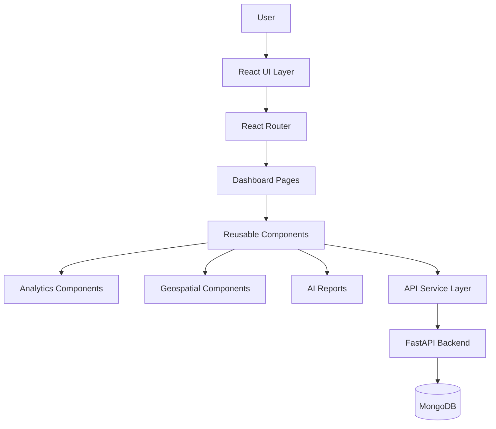
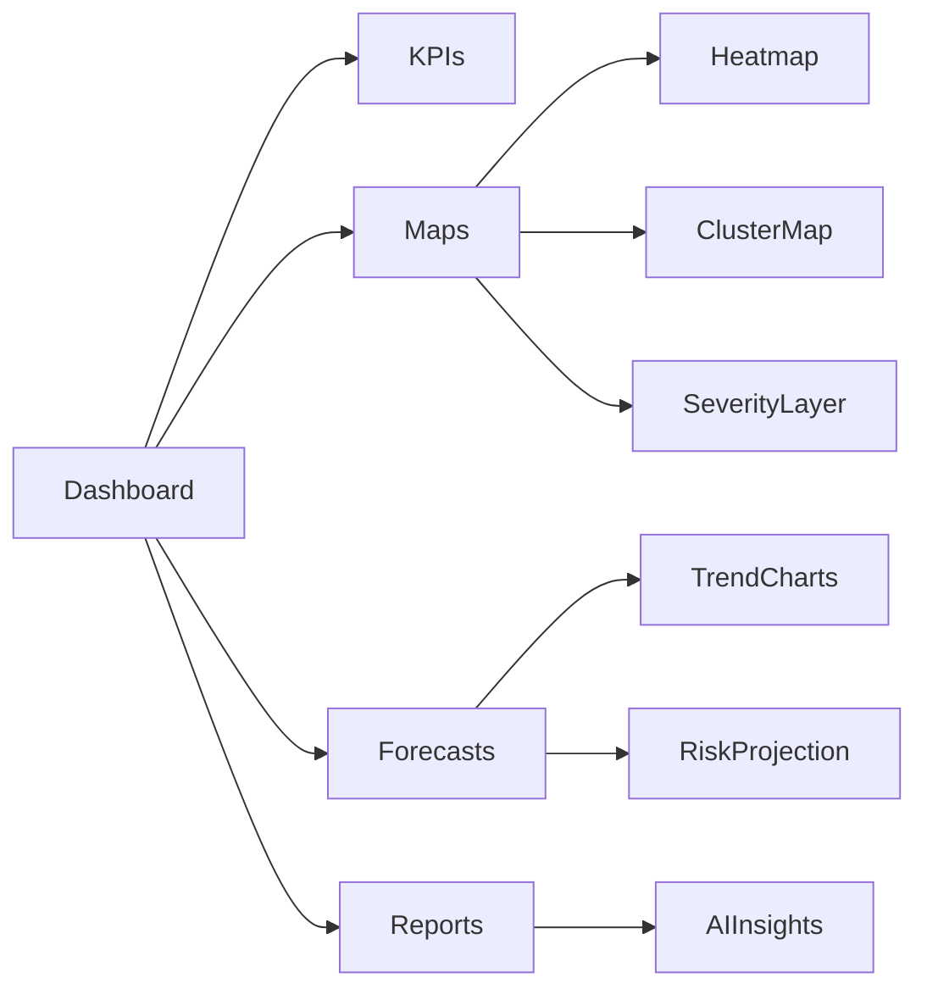
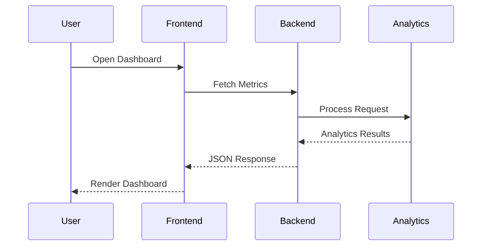
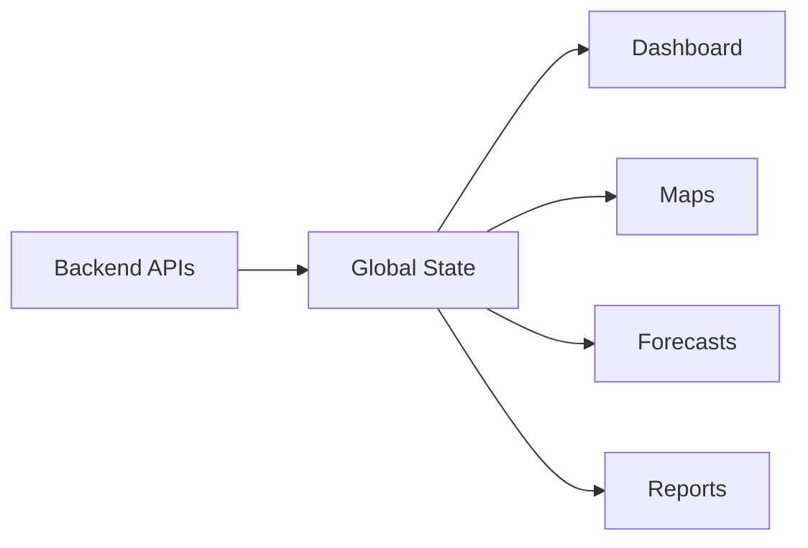

# ParkPulse AI Frontend

---

## Overview

ParkPulse AI Frontend is a modern geospatial intelligence dashboard designed to visualize parking-induced traffic congestion through interactive maps, predictive analytics, executive dashboards, and AI-generated operational insights.

The application transforms complex mobility datasets into intuitive visual experiences that enable city administrators, traffic enforcement agencies, transportation planners, and smart-city operators to make data-driven decisions in real time.

---

# Core Features

### Executive Dashboard

Provides a centralized view of city-wide parking intelligence.

**Key Metrics**

- Total Violations
- Active Hotspots
- Critical Congestion Zones
- Capacity Loss
- Severity Distribution
- Forecasted Risk Levels

---

### Interactive Geospatial Visualization

Displays congestion hotspots using dynamic geospatial rendering.

Capabilities include:

- Interactive City Map
- Heatmaps
- Cluster Visualization
- Severity Overlay
- Hotspot Navigation
- Geographic Filtering

---

### Predictive Intelligence

Visualizes future congestion forecasts generated by the analytics engine.

Features:

- Hourly Forecasts
- Daily Forecasts
- Weekly Forecasts
- Trend Analysis
- Severity Projection

---

### AI Intelligence Reports

Presents AI-generated operational summaries.

Outputs include:

- Executive Reports
- Traffic Insights
- Enforcement Recommendations
- Congestion Analysis
- Trend Summaries

---

### Authentication & Access Control

Supports secure access through:

- JWT Authentication
- Protected Routes
- Session Persistence
- Role-Based Views
- Secure Logout

---

# Frontend Architecture

---

# User Interface Architecture

---

# Application Flow

---

# Component Architecture

## Layout Components

Responsible for:

- Navigation
- Sidebar
- Header
- Responsive Layout
- Route Management

---

## Dashboard Components

Responsible for:

- KPI Cards
- Statistical Widgets
- Summary Panels
- Forecast Widgets

---

## Geospatial Components

Responsible for:

- Leaflet Maps
- Heatmaps
- Cluster Layers
- Marker Rendering
- Spatial Filtering

---

## Visualization Components

Responsible for:

- Trend Charts
- Distribution Graphs
- Severity Analysis
- Forecast Displays

---

## Reporting Components

Responsible for:

- AI Summaries
- Recommendation Panels
- Executive Briefs
- Intelligence Reports

---

# State Management

The frontend maintains centralized application state for:

- User Sessions
- Dashboard Metrics
- Hotspot Data
- Forecast Results
- AI Reports

---

# Visualization Engine

The visualization layer transforms analytical outputs into intuitive graphical representations.

### Supported Visualizations

| Visualization | Purpose |
|--------------|----------|
| KPI Cards | Executive Metrics |
| Heatmaps | Violation Density |
| Cluster Maps | Hotspot Visualization |
| Line Charts | Forecast Trends |
| Bar Charts | Severity Distribution |
| Reports | AI Insights |

---

# Responsive Design

The interface is optimized for:

- Desktop Workstations
- Smart City Command Centers
- Tablets
- Mobile Devices

Key characteristics:

- Adaptive Layouts
- Fluid Components
- Responsive Maps
- Dynamic Chart Scaling

---

# Performance Characteristics

| Metric | Capability |
|----------|------------|
| Rendering Engine | React |
| Mapping Engine | Leaflet |
| API Communication | REST |
| State Updates | Real-Time |
| Dashboard Refresh | Dynamic |
| Mobile Support | Responsive |
| Deployment | Production Ready |

---

# Design Principles

- Data-Driven Decision Making
- Human-Centered Visualization
- Real-Time Situational Awareness
- Scalable Component Architecture
- Responsive User Experience
- Smart City Operational Readiness

---

# License

This project is licensed under the MIT License.

---

# Contributors

Rithanya Raj & Anjan Mahapatra
